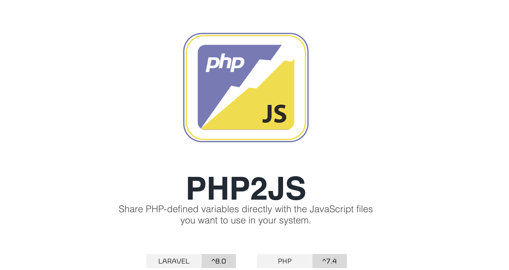

## Introduction

While there are multiple frontend frameworks available today, we understand that monoliths created with Laravel Framework will continue to exist for a long time, and this is not at all negative. The most effective solution does not always lie in using the latest generation framework. Sometimes, it is more efficient for a development team to leverage standard technologies and the knowledge they already possess.

By using technologies such as jQuery, Vanilla JavaScript, HTML, CSS, and Laravel's Blade view engine, you can achieve surprising and highly functional results. However, we felt that something was missing: a simple, elegant, and efficient way to share data from the server with frontend developed in JavaScript. We didn't find it comfortable to insert JavaScript snippets into our views; we always aimed to separate this logic into independent files.

That's when the requests to the server started to increase to fetch variables that were already present in the view. After a long time of contemplating what the most effective solution would be, we decided to create this solution that standardizes and simplifies the process of sharing data from PHP to JavaScript.

You may wonder how it's possible to do this since these are different approaches in each language. Let us tell you that we also faced that challenge, but now we have resolved it.

Enjoy the ease of creating a web application without overloading the server with unnecessary requests.

::: tip Working this way is still great!
Are you still passionate about the classic practices of JavaScript Vanilla or jQuery, instead of the well-known frameworks like Svelte, React, Vue, or Angular? If so, you're in the right place!

We've devised this solution specifically tailored for you. Our mission is to prevent you from unnecessarily overloading your servers with constant requests. While there are other options in the market, we're confident you'll be surprised when you test the resource consumption. We understand that in applications with high recurrence, this can cause problems. So, if you already have the data in JavaScript, you might become a fan of `.filter`, `.map`, `.foreach`, etc.. That's better than sending requests to the backend for every action. Only do that if necessary.

We're thrilled to introduce our package, meticulously designed to lighten your server load and enhance the performance of your projects. We believe this tool will become a vital asset for your development teams and your creative projects!
:::